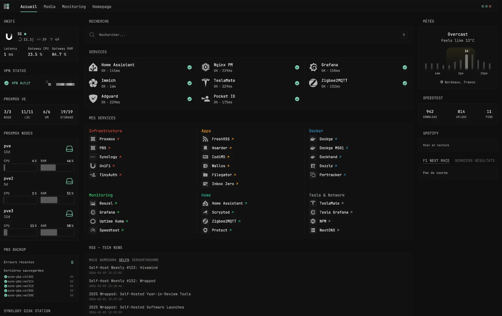
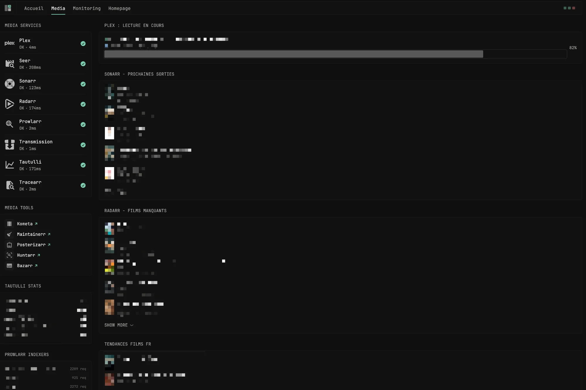
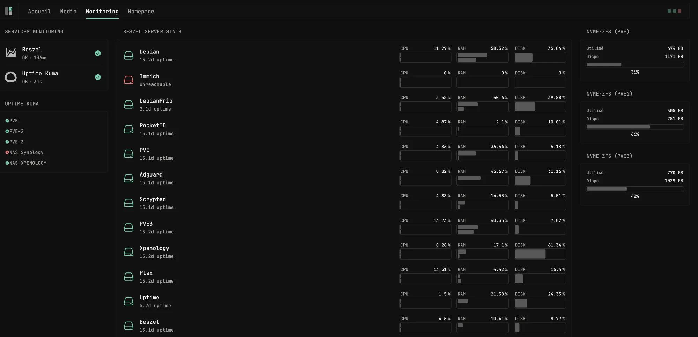

# 🖥️ Glance Dashboard - Homelab

[](README.fr.md)

A monitoring dashboard for homelab based on [Glance](https://github.com/glanceapp/glance).


## 🎯 Purpose

This dashboard is designed to be **your browser's homepage** for quick access to all your homelab services and a quick glance at relevant information.

Deployed on **Dockge** on a Debian VM — lightweight and perfectly optimized.

## 📸 Screenshots

### Accueil


### Media


### Monitoring


## ✨ Features

- **Infrastructure**: Proxmox VE (3 nodes), PBS Backup, Synology NAS, UniFi
- **Media Stack**: Plex, Sonarr, Radarr, Prowlarr, Tautulli, Transmission
- **Monitoring**: Beszel, Uptime Kuma, Speedtest Tracker
- **Home Automation**: Home Assistant, Zigbee2MQTT, Scrypted
- **Extras**: Weather, RSS Tech News (Macg, Numerama, Selfh.st, ServeTheHome), F1 Calendar, Spotify Now Playing

## 🚀 Installation

### Prerequisites

- Docker & Docker Compose (or Dockge)
- The services you want to monitor

### Deployment

1. **Download the files**
   
   Download the files from this repository or clone it.

2. **Configure environment variables**
   ```bash
   cp .env.example .env
   nano .env  # Fill with your actual values
   ```

3. **Adapt URLs** (optional)
   ```bash
   nano urls.env  # Modify according to your infrastructure
   ```

4. **Start the dashboard**
   ```bash
   docker-compose up -d
   ```

5. **Access the dashboard**
   ```
   http://localhost:8083
   ```

## 📁 Structure

```
glance-dashboard/
├── docker-compose.yml    # Docker configuration
├── glance.yml            # Glance configuration (place in /docker/glance/config/)
├── urls.env              # Service URLs
├── .env.example          # Secrets template
├── .env                  # Your secrets (not versioned)
├── screenshots/          # Dashboard screenshots
└── README.md
```

## ⚙️ Configuration

### Environment Files

| File | Description | Git |
|------|-------------|-----|
| `.env` | API keys, passwords, tokens | ❌ Ignored |
| `.env.example` | Template to copy | ✅ Versioned |
| `urls.env` | Your service URLs | ✅ Versioned |

### Required Variables

<details>
<summary>📋 Variables List</summary>

#### Infrastructure
| Variable | Description |
|----------|-------------|
| `PVE_API_TOKEN` | Proxmox VE API Token |
| `PBS_API_TOKEN` | Proxmox Backup Server API Token |
| `SYNOLOGY_USER` / `SYNOLOGY_PASSWORD` | Synology credentials |
| `UNIFI_API_KEY` | UniFi API Key |

#### Media
| Variable | Description |
|----------|-------------|
| `TAUTULLI_API_KEY` | Tautulli API Key |
| `SONARR_API_KEY` | Sonarr API Key |
| `RADARR_API_KEY` | Radarr API Key |
| `PROWLARR_API_KEY` | Prowlarr API Key |
| `TMDB_API_KEY` | TMDB API Key |
| `OVERSEERR_API` | Overseerr API Key |
| `TRANSMISSION_USER` / `TRANSMISSION_PASSWORD` | Transmission credentials |

#### Monitoring
| Variable | Description |
|----------|-------------|
| `SPEEDTEST_API_KEY` | Speedtest Tracker Token |
| `BESZEL_API_KEY` | Beszel JWT Token |

</details>

### Getting API Keys

<details>
<summary>🔑 Quick Guide</summary>

| Service | Location |
|---------|----------|
| **Proxmox** | Datacenter → Permissions → API Tokens |
| **Sonarr/Radarr/Prowlarr** | Settings → General → API Key |
| **Tautulli** | Settings → Web Interface → API Key |
| **TMDB** | [themoviedb.org/settings/api](https://www.themoviedb.org/settings/api) |
| **Beszel** | Settings → API Keys |
| **Overseerr** | Settings → General → API Key |

</details>

## 🎨 Customization

### Theme

Edit in `glance.yml`:
```yaml
theme:
  background-color: 50 1 6      # HSL
  primary-color: 157 47 65      # HSL
  contrast-multiplier: 1.1
```

### Pages

The `glance.yml` file is organized by pages:
- `Accueil` - Infrastructure overview, services, bookmarks
- `Media` - Plex/Arr stack, Tautulli stats, trends
- `Monitoring` - Beszel server stats, Uptime Kuma, storage

## 🔒 Security

- ⚠️ Never commit the `.env` file
- Internal URLs (`10.x.x.x`) are not accessible from outside
- Use a reverse proxy (NPM, Traefik) for external exposure

## 📝 Notes

- Spotify widget requires an OAuth token stored in `/app/config/spotify_token.txt`
- Some widgets use `allow-insecure: true` for self-signed certificates
- Cache configured per widget (1m to 1h depending on update frequency)
- F1 API runs as a separate container for race calendar data

## 🙏 Credits

- [Glance](https://github.com/glanceapp/glance) - The original project
- [Beszel Community Widget](https://github.com/glanceapp/glance/discussions) - Beszel widget
- [Glance F1 Widget](https://github.com/SkyAllinott/glance-F1) - Formula 1 calendar widget
- [Claude by Anthropic](https://claude.ai) - Vibe coded with AI assistance 🤖

## 📄 License

MIT License - Free to use and modify.

---

<p align="center">
  <i>Built with ❤️ for the homelab community</i>
</p>
